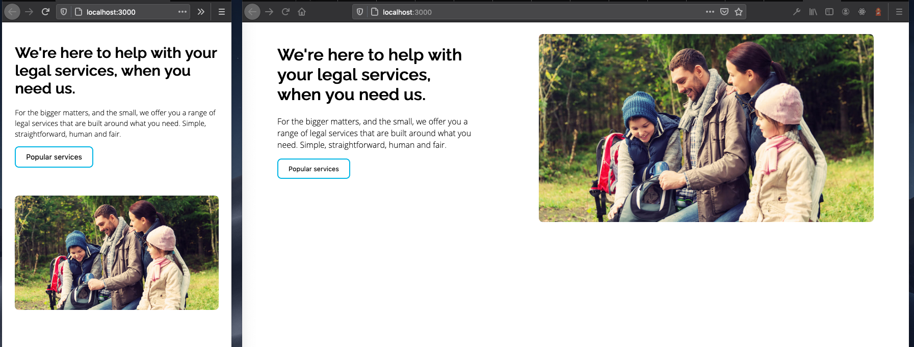

## S+G Technical Test

Author: Justin Sandahl

## The Brief 

**Introduction**

This project is a bare bones Node.js web application serving up basic index.html and linked styles.css file. The objective is to:

 - Clone the application to your development PC
 - Commit the basic project to your own github repository
 - Using the IDE of your choice (we use VS Code), make changes to the html/css files in order to create the designed component

**Pointers**

The component is pretty simple. What we would like to see is your approach and clean easy to read coding.

 - Make regular commits along the way to show working 
 - Use the README.md markdown file to document your approach
 - The stylesheet is already added to the project but add your own javascript file to the project 
 - Styling doesn't have to be the same, use your own imagination if you like
 - Think about media queries to create the responsive effect between desktop/mobile
 - Make the button navigate to a different page
 - Stick with standard frameworks (i.e. plain javascript and html)

## The Approach

The approach taken was to start by creating the base HTML layout of elements needed in order order to build out the CSS and get all the elements set-up visually. This allowed for the necessary class names to have been created to be called upon when begining to refactor the component to be dynamically rendered. 

The base HTML comprises of a main-container which then is split into two sub-sections - text-wrapper and image-wrapper, respectively. This provides better flexibilty to use css-grid (denonted by `display: grid` on the `main-container` class), which provides easy way to align HTML sections in a grid formation while being responsive. 

From here is was a matter of getting the sizing/styling correct for the child elements contained within the two sections. 

Media queries we're used to primarily to progressively scale the size of the text for smaller screens (below 1200px) so as to not have text flowing below the image. The final query re-orders the grid to display in a single column after a breakpoint of 930px.

Handling of the button click was done using JavaScript and the addEventlistener() method to listen on the element with ".btn" as it's class and if that element is clicked it directs to a new url. 

From this point the component worked, however, the component is not dynamically rendered, so it was not very re-usable at this stage, so the next phase was to refactor and use client-side JavaScript and the DOM API to create the elements. This was achieved using the previously made HTML as a template for providing the structure for the types of elements to be created and the classes/attributes necessary. 

The final part of having the component truly dynamic and reusable was to implement a data.json file, which essentially acts as a pseudo-CMS where the content of the component is store within the .json file and is then retrieved using the in-built fetch() method to retrieve the data. The data then gets parsed as json using .json() and then data cycled over using a callback function and by using .forEach() method within to create a new component and then append it to the "main-container" which is the lone 
 in the final HTML.

This allows the ability to create multiple components on the page, or edit the content of the component just by adding the neccesary content to the data.json. Note - components are rendered to the top of the "main-container" in the DOM, so the data.json file gets rendered bottom to top, this could be changed by changing the last two lines of code to be .appendChild() methods on the mainContainer depending on preferance. 

## Sample Screenshot of the final component

## What more could I have done

I would have like to implement some unit tests on the main.js file, however the testing package I'm most familiar with (JEST) has been used with a Framework like React, in order to use with Vanilla JS I would have needed to install Babel as well to support ES6 functions (i.e. Fetch) and then also wrap the code in an immediately invoked function to provide some logic for the exporting of the module to work as well. For such a small component and to keep node packages a slim as possible the end to end testing was sufficient, but in a larger project and with more time I would have installed the additonal configurations required. 

## Tools used

Built using:
- Vanilla Javascript
- HTML
- CSS 
- CSS grid
- Fetch

## How to run 
**Clone the repo**

`git clone git@github.com:jdsandahl/sg-technical-test.git`

**Install dependecies**

`npm install`

**Start development server**

`npm start`

In your browser, open http://localhost:3000

